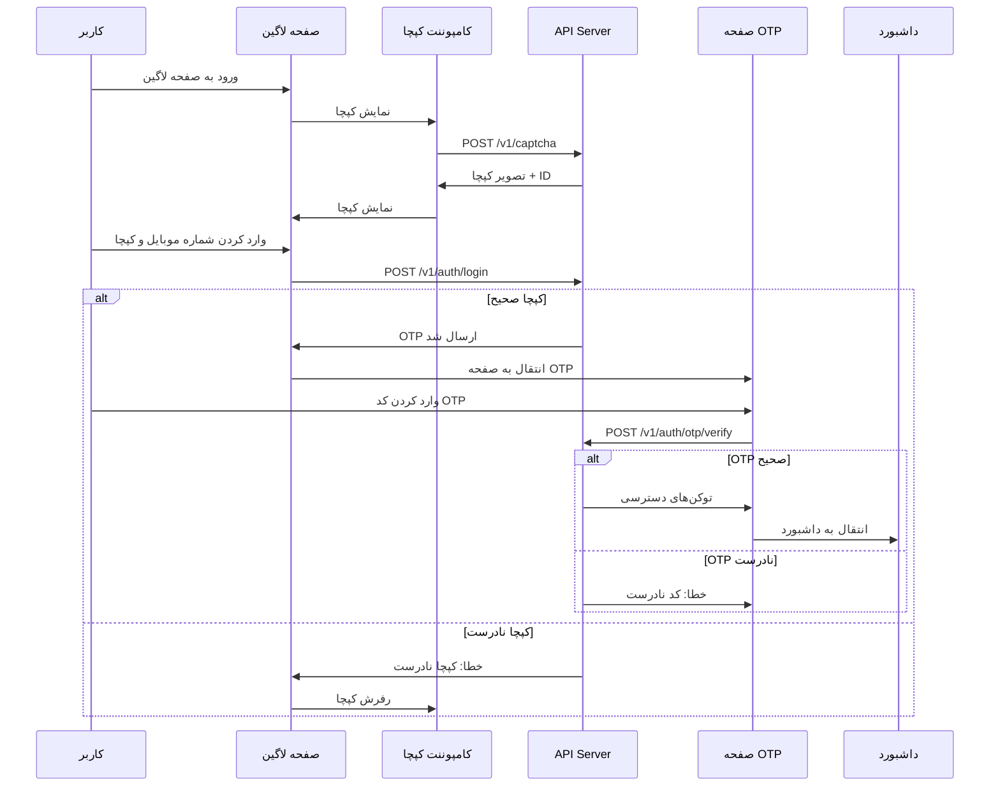

# 🔐 راهنمای کامل صفحه لاگین و احراز هویت

## 📍 مسیرهای (Routes) صفحه لاگین

### 1️⃣ مسیرهای فعلی در برنامه

```
/api/login           → صفحه ورود با شماره موبایل و کپچا
/api/otp-verify      → صفحه تایید کد OTP
```

### 2️⃣ مسیرهای Demo (بدون API واقعی)

```
/login               → صفحه ورود دمو
/otp-verify          → صفحه OTP دمو
```

---

## 🌐 API Endpoints مورد نیاز

### Base URL
```
https://elevatorid.ieeu.ir/v1
```

---

## 1️⃣ دریافت کپچا

### Endpoint
```http
POST /v1/captcha
```

### Headers
```json
{
  "Content-Type": "application/json"
}
```

### Request Body
```json
{
  "width": 200,
  "height": 70
}
```

### Response (200 OK)
```json
{
  "captcha_id": "550e8400-e29b-41d4-a716-446655440000",
  "captcha_image": "data:image/png;base64,iVBORw0KGgoAAAANSUhEUgAA..."
}
```

### Error Responses

#### 400 Bad Request
```json
{
  "error": "Invalid request parameters"
}
```

#### 500 Internal Server Error
```json
{
  "error": "Failed to generate captcha"
}
```

---

## 2️⃣ ورود (Login)

### Endpoint
```http
POST /v1/auth/login
```

### Headers
```json
{
  "Content-Type": "application/json"
}
```

### Request Body
```json
{
  "mobile": "09123456789",
  "captcha_id": "550e8400-e29b-41d4-a716-446655440000",
  "captcha_value": "ABC123"
}
```

### Validation Rules
- **mobile**: باید با 09 شروع شود و 11 رقم باشد
- **captcha_id**: UUID معتبر
- **captcha_value**: رشته 6 کاراکتری

### Response (200 OK)
```json
{
  "message": "کد تایید با موفقیت ارسال شد",
  "otp_sent": true,
  "expires_in": 120
}
```

### Error Responses

#### 400 Bad Request - شماره موبایل نامعتبر
```json
{
  "error": "شماره موبایل نامعتبر است"
}
```

#### 400 Bad Request - کپچا نادرست
```json
{
  "error": "کد تصویر نادرست است"
}
```

#### 404 Not Found - کپچا منقضی شده
```json
{
  "error": "کد تصویر منقضی شده است"
}
```

#### 429 Too Many Requests
```json
{
  "error": "تعداد درخواست‌ها بیش از حد مجاز است. لطفاً بعداً تلاش کنید"
}
```

---

## 3️⃣ تایید OTP

### Endpoint
```http
POST /v1/auth/otp/verify
```

### Headers
```json
{
  "Content-Type": "application/json"
}
```

### Request Body
```json
{
  "mobile": "09123456789",
  "otp": "123456"
}
```

### Validation Rules
- **mobile**: باید با 09 شروع شود و 11 رقم باشد
- **otp**: رشته 6 رقمی

### Response (200 OK)
```json
{
  "access_token": "eyJhbGciOiJIUzI1NiIsInR5cCI6IkpXVCJ9...",
  "refresh_token": "eyJhbGciOiJIUzI1NiIsInR5cCI6IkpXVCJ9...",
  "token_type": "Bearer",
  "expires_in": 3600,
  "user": {
    "id": "123",
    "mobile": "09123456789",
    "role": "admin",
    "name": "علی احمدی",
    "email": "ali@example.com"
  }
}
```

### Error Responses

#### 400 Bad Request - کد OTP نادرست
```json
{
  "error": "کد تایید نادرست است"
}
```

#### 404 Not Found - OTP منقضی شده
```json
{
  "error": "کد تایید منقضی شده است. لطفاً مجدداً درخواست دهید"
}
```

#### 429 Too Many Requests
```json
{
  "error": "تعداد تلاش‌های نادرست بیش از حد مجاز است"
}
```

---

## 4️⃣ تازه‌سازی توکن (Refresh Token)

### Endpoint
```http
POST /v1/auth/refresh
```

### Headers
```json
{
  "Content-Type": "application/json",
  "Authorization": "Bearer {refresh_token}"
}
```

### Request Body
```json
{
  "refresh_token": "eyJhbGciOiJIUzI1NiIsInR5cCI6IkpXVCJ9..."
}
```

### Response (200 OK)
```json
{
  "access_token": "eyJhbGciOiJIUzI1NiIsInR5cCI6IkpXVCJ9...",
  "token_type": "Bearer",
  "expires_in": 3600
}
```

### Error Responses

#### 401 Unauthorized
```json
{
  "error": "توکن نامعتبر یا منقضی شده است"
}
```

---

## 📂 فایل‌های مرتبط در پروژه

### 1. Components

#### `/components/api-auth/Login.tsx`
صفحه اصلی لاگین که شامل:
- فرم ورود شماره موبایل
- کامپوننت کپچا
- اعتبارسنجی لحظه‌ای
- مدیریت خطاها

#### `/components/api-auth/OTPVerification.tsx`
صفحه تایید OTP که شامل:
- Input OTP 6 رقمی
- تایمر شمارش معکوس
- دکمه ارسال مجدد کد
- مدیریت خطاها

#### `/components/common/CaptchaComponent.tsx`
کامپوننت کپچا که شامل:
- نمایش تصویر کپچا
- دکمه رفرش کپچا
- Input ورود کد
- مدیریت وضعیت کپچا

---

### 2. Services

#### `/services/auth.service.ts`
سرویس احراز هویت:
```typescript
export const authService = {
  login: (mobile: string, captchaId: string, captchaValue: string),
  verifyOTP: (mobile: string, otp: string),
  refreshToken: (refreshToken: string),
  logout: ()
}
```

#### `/services/captcha.service.ts`
سرویس کپچا:
```typescript
export const captchaService = {
  getCaptcha: (width?: number, height?: number),
  validateCaptcha: (captchaId: string, captchaValue: string)
}
```

---

### 3. Hooks

#### `/hooks/useApi.ts`
هوک مدیریت درخواست‌های API:
```typescript
export const useApi = () => {
  const makeRequest = async (config: RequestConfig) => { ... }
  return { makeRequest, loading, error }
}
```

---

### 4. Context

#### `/contexts/AuthContext.tsx`
کانتکست احراز هویت:
```typescript
export const AuthProvider = ({ children }) => { ... }
export const useAuth = () => useContext(AuthContext)
```

---

### 5. API Client

#### `/lib/api-client.ts`
کلاینت اصلی API:
```typescript
export const apiClient = {
  get: (url: string, config?: AxiosRequestConfig),
  post: (url: string, data?: any, config?: AxiosRequestConfig),
  put: (url: string, data?: any, config?: AxiosRequestConfig),
  delete: (url: string, config?: AxiosRequestConfig)
}
```

---

## 🔄 جریان (Flow) کامل احراز هویت



---

## 🛠️ نحوه استفاده در کد

### 1. دریافت و نمایش کپچا

```tsx
import { useState, useEffect } from 'react';
import { captchaService } from '../services/captcha.service';

function LoginPage() {
  const [captchaId, setCaptchaId] = useState('');
  const [captchaImage, setCaptchaImage] = useState('');

  const fetchCaptcha = async () => {
    try {
      const data = await captchaService.getCaptcha(200, 70);
      setCaptchaId(data.captcha_id);
      setCaptchaImage(data.captcha_image);
    } catch (error) {
      console.error('خطا در دریافت کپچا:', error);
    }
  };

  useEffect(() => {
    fetchCaptcha();
  }, []);

  return (
    <div>
      
      <button onClick={fetchCaptcha}>رفرش کپچا</button>
    </div>
  );
}
```

---

### 2. ارسال درخواست لاگین

```tsx
import { useState } from 'react';
import { useNavigate } from 'react-router-dom';
import { authService } from '../services/auth.service';
import { toast } from 'sonner';

function LoginForm() {
  const navigate = useNavigate();
  const [mobile, setMobile] = useState('');
  const [captchaValue, setCaptchaValue] = useState('');
  const [captchaId, setCaptchaId] = useState('');
  const [loading, setLoading] = useState(false);

  const handleLogin = async (e: React.FormEvent) => {
    e.preventDefault();
    setLoading(true);

    try {
      await authService.login(mobile, captchaId, captchaValue);
      toast.success('کد تایید ارسال شد');
      navigate('/api/otp-verify', { state: { mobile } });
    } catch (error: any) {
      toast.error(error.message || 'خطا در ورود');
    } finally {
      setLoading(false);
    }
  };

  return (
    <form onSubmit={handleLogin}>
      <input 
        type="tel" 
        value={mobile}
        onChange={(e) => setMobile(e.target.value)}
        placeholder="شماره موبایل"
      />
      {/* کامپوننت کپچا */}
      <button type="submit" disabled={loading}>
        {loading ? 'در حال ارسال...' : 'ورود'}
      </button>
    </form>
  );
}
```

---

### 3. تایید OTP

```tsx
import { useState } from 'react';
import { useNavigate, useLocation } from 'react-router-dom';
import { authService } from '../services/auth.service';
import { useAuth } from '../contexts/AuthContext';
import { toast } from 'sonner';

function OTPVerification() {
  const navigate = useNavigate();
  const location = useLocation();
  const { login } = useAuth();
  const [otp, setOtp] = useState('');
  const [loading, setLoading] = useState(false);

  const mobile = location.state?.mobile || '';

  const handleVerify = async (e: React.FormEvent) => {
    e.preventDefault();
    setLoading(true);

    try {
      const response = await authService.verifyOTP(mobile, otp);
      
      // ذخیره توکن‌ها
      localStorage.setItem('access_token', response.access_token);
      localStorage.setItem('refresh_token', response.refresh_token);
      
      // به‌روزرسانی context
      login(response.user);
      
      toast.success('ورود موفقیت‌آمیز');
      
      // انتقال به داشبورد مناسب
      if (response.user.role === 'admin') {
        navigate('/api/admin');
      } else {
        navigate('/api/user');
      }
    } catch (error: any) {
      toast.error(error.message || 'کد تایید نادرست است');
    } finally {
      setLoading(false);
    }
  };

  return (
    <form onSubmit={handleVerify}>
      <input 
        type="text" 
        value={otp}
        onChange={(e) => setOtp(e.target.value)}
        placeholder="کد تایید 6 رقمی"
        maxLength={6}
      />
      <button type="submit" disabled={loading}>
        {loading ? 'در حال تایید...' : 'تایید'}
      </button>
    </form>
  );
}
```

---

## 🔒 مدیریت توکن‌ها

### ذخیره توکن‌ها
```typescript
localStorage.setItem('access_token', accessToken);
localStorage.setItem('refresh_token', refreshToken);
```

### خواندن توکن‌ها
```typescript
const accessToken = localStorage.getItem('access_token');
const refreshToken = localStorage.getItem('refresh_token');
```

### حذف توکن‌ها (خروج)
```typescript
localStorage.removeItem('access_token');
localStorage.removeItem('refresh_token');
```

---

## 🔐 افزودن توکن به درخواست‌ها

```typescript
import axios from 'axios';

const api = axios.create({
  baseURL: 'https://elevatorid.ieeu.ir/v1'
});

// Interceptor برای افزودن توکن
api.interceptors.request.use((config) => {
  const token = localStorage.getItem('access_token');
  if (token) {
    config.headers.Authorization = `Bearer ${token}`;
  }
  return config;
});

// Interceptor برای مدیریت خطای 401
api.interceptors.response.use(
  (response) => response,
  async (error) => {
    const originalRequest = error.config;

    if (error.response?.status === 401 && !originalRequest._retry) {
      originalRequest._retry = true;

      try {
        const refreshToken = localStorage.getItem('refresh_token');
        const response = await axios.post(
          'https://elevatorid.ieeu.ir/v1/auth/refresh',
          { refresh_token: refreshToken }
        );

        const { access_token } = response.data;
        localStorage.setItem('access_token', access_token);

        originalRequest.headers.Authorization = `Bearer ${access_token}`;
        return api(originalRequest);
      } catch (error) {
        // خروج کاربر
        localStorage.clear();
        window.location.href = '/api/login';
      }
    }

    return Promise.reject(error);
  }
);

export default api;
```

---

## ⚠️ مدیریت خطاها

### خطاهای رایج و راه‌حل‌ها

| کد خطا | پیام | راه‌حل |
|--------|------|--------|
| 400 | شماره موبایل نامعتبر | بررسی فرمت شماره (09xxxxxxxxx) |
| 400 | کد تصویر نادرست | دریافت کپچای جدید |
| 404 | کد تصویر منقضی شده | دریافت کپچای جدید |
| 429 | درخواست بیش از حد | صبر کردن و تلاش مجدد |
| 401 | توکن نامعتبر | رفرش توکن یا ورود مجدد |
| 500 | خطای سرور | تلاش مجدد بعد از چند ثانیه |

---

## 📱 نمونه کامل صفحه لاگین

```tsx
import { useState, useEffect } from 'react';
import { useNavigate } from 'react-router-dom';
import { Card, CardContent, CardHeader, CardTitle } from '../ui/card';
import { Button } from '../ui/button';
import { Input } from '../ui/input';
import { Label } from '../ui/label';
import CaptchaComponent from '../common/CaptchaComponent';
import { authService } from '../../services/auth.service';
import { toast } from 'sonner';

export default function Login() {
  const navigate = useNavigate();
  const [mobile, setMobile] = useState('');
  const [captcha, setCaptcha] = useState('');
  const [captchaId, setCaptchaId] = useState('');
  const [captchaValid, setCaptchaValid] = useState(false);
  const [loading, setLoading] = useState(false);

  const validateMobile = (value: string) => {
    return /^09\d{9}$/.test(value);
  };

  const handleSubmit = async (e: React.FormEvent) => {
    e.preventDefault();

    if (!validateMobile(mobile)) {
      toast.error('شماره موبایل نامعتبر است');
      return;
    }

    if (!captchaValid || !captcha) {
      toast.error('لطفاً کد تصویر را وارد کنید');
      return;
    }

    setLoading(true);

    try {
      await authService.login(mobile, captchaId, captcha);
      toast.success('کد تایید با موفقیت ارسال شد');
      navigate('/api/otp-verify', { state: { mobile } });
    } catch (error: any) {
      toast.error(error.message || 'خطا در ارسال کد تایید');
    } finally {
      setLoading(false);
    }
  };

  return (
    <div className="min-h-screen flex items-center justify-center bg-gray-50" dir="rtl">
      <Card className="w-full max-w-md">
        <CardHeader>
          <CardTitle>ورود به سامانه</CardTitle>
        </CardHeader>
        <CardContent>
          <form onSubmit={handleSubmit} className="space-y-4">
            <div>
              <Label htmlFor="mobile">شماره موبایل</Label>
              <Input
                id="mobile"
                type="tel"
                value={mobile}
                onChange={(e) => setMobile(e.target.value)}
                placeholder="09123456789"
                maxLength={11}
                dir="ltr"
              />
            </div>

            <CaptchaComponent
              onCaptchaChange={setCaptcha}
              onCaptchaIdChange={setCaptchaId}
              onValidityChange={setCaptchaValid}
              disabled={loading}
            />

            <Button 
              type="submit" 
              className="w-full"
              disabled={loading || !captchaValid}
            >
              {loading ? 'در حال ارسال...' : 'دریافت کد تایید'}
            </Button>
          </form>
        </CardContent>
      </Card>
    </div>
  );
}
```

---

## 🧪 تست API با cURL

### 1. دریافت کپچا
```bash
curl -X POST https://elevatorid.ieeu.ir/v1/captcha \
  -H "Content-Type: application/json" \
  -d '{"width": 200, "height": 70}'
```

### 2. ورود
```bash
curl -X POST https://elevatorid.ieeu.ir/v1/auth/login \
  -H "Content-Type: application/json" \
  -d '{
    "mobile": "09123456789",
    "captcha_id": "550e8400-e29b-41d4-a716-446655440000",
    "captcha_value": "ABC123"
  }'
```

### 3. تایید OTP
```bash
curl -X POST https://elevatorid.ieeu.ir/v1/auth/otp/verify \
  -H "Content-Type: application/json" \
  -d '{
    "mobile": "09123456789",
    "otp": "123456"
  }'
```

---

## 📊 نمودار وضعیت‌ها (State Diagram)

```
[شروع] 
  ↓
[دریافت کپچا] 
  ↓
[ورود شماره موبایل و کپچا]
  ↓
[اعتبارسنجی] ← [خطا؟] → [نمایش خطا]
  ↓ (موفق)
[ارسال OTP]
  ↓
[صفحه تایید OTP]
  ↓
[ورود کد OTP]
  ↓
[اعتبارسنجی OTP] ← [خطا؟] → [نمایش خطا]
  ↓ (موفق)
[دریافت توکن‌ها]
  ↓
[ذخیره در LocalStorage]
  ↓
[انتقال به داشبورد]
```

---

## 🎯 نکات مهم

1. **امنیت**: همیشه از HTTPS استفاده کنید
2. **Timeout**: برای درخواست‌ها timeout تنظیم کنید (30 ثانیه)
3. **Retry**: در صورت خطا، حداکثر 3 بار تلاش مجدد کنید
4. **Rate Limiting**: از ارسال درخواست‌های متعدد جلوگیری کنید
5. **User Experience**: از Loading state و پیام‌های مناسب استفاده کنید
6. **Error Handling**: همه خطاها را به زبان فارسی نمایش دهید
7. **Token Management**: توکن‌ها را به صورت امن ذخیره کنید
8. **Accessibility**: از label ها و aria-label ها استفاده کنید

---

## 📞 پشتیبانی

در صورت بروز مشکل، به فایل‌های زیر مراجعه کنید:
- `/docs/API-Endpoints-Guide.md`
- `/docs/Captcha-Integration-Guide.md`
- `/docs/Security-Updates.md`

یا از فرم تست API استفاده کنید:
- `/components/common/APITestForm.tsx`