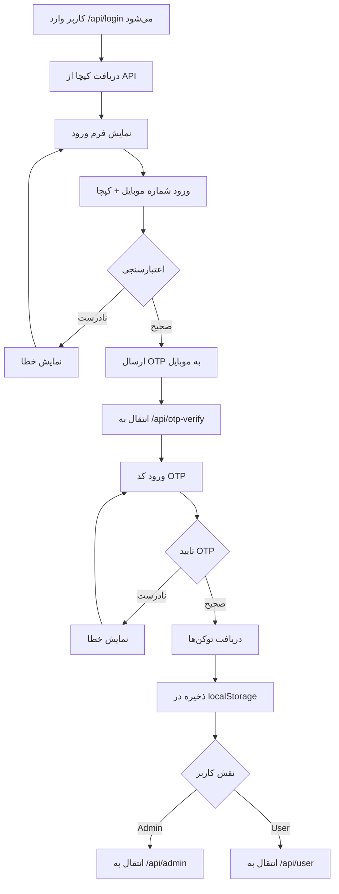

# 🔐 مستندات کامل سیستم احراز هویت

## 📚 فهرست مستندات

| سند | توضیحات | لینک |
|-----|----------|------|
| 📖 راهنمای کامل | مستندات جامع و کامل لاگین | [Login-Complete-Guide.md](./Login-Complete-Guide.md) |
| ⚡ مرجع سریع | دستورات و نمونه‌های سریع | [Login-Quick-Reference.md](./Login-Quick-Reference.md) |
| ⚙️ پیکربندی | تنظیمات و configuration | [Login-Configuration.md](./Login-Configuration.md) |
| 🔧 عیب‌یابی | حل مشکلات رایج | [Login-Troubleshooting.md](./Login-Troubleshooting.md) |
| 🔒 امنیت | راهنمای امنیتی | [Security-Updates.md](./Security-Updates.md) |
| 🖼️ کپچا | راهنمای کپچا | [Captcha-Integration-Guide.md](./Captcha-Integration-Guide.md) |
| 🌐 API | راهنمای کامل API | [API-Endpoints-Guide.md](./API-Endpoints-Guide.md) |

---

## 🚀 شروع سریع

### 1️⃣ مسیرهای اصلی

```
/api/login           → صفحه ورود با API واقعی
/api/otp-verify      → صفحه تایید OTP
```

### 2️⃣ API Endpoints

```
BASE URL: https://elevatorid.ieeu.ir/v1

POST /v1/captcha              → دریافت کپچا
POST /v1/auth/login           → ورود با موبایل
POST /v1/auth/otp/verify      → تایید OTP
POST /v1/auth/refresh         → تازه‌سازی توکن
```

### 3️⃣ نمونه کد سریع

```typescript
import { authService } from '../services/auth.service';

// Login
await authService.login(mobile, captchaId, captcha);

// Verify OTP
const response = await authService.verifyOTP(mobile, otp);
localStorage.setItem('access_token', response.access_token);
```

---

## 📂 ساختار فایل‌ها

```
/components
  /api-auth
    ├── Login.tsx                    → صفحه اصلی لاگین
    └── OTPVerification.tsx          → صفحه تایید OTP
  /common
    ├── CaptchaComponent.tsx         → کامپوننت کپچا
    ├── ProtectedRoute.tsx           → محافظت مسیرها
    └── APITestForm.tsx              → فرم تست API

/services
  ├── auth.service.ts                → سرویس احراز هویت
  └── captcha.service.ts             → سرویس کپچا

/contexts
  └── AuthContext.tsx                → کانتکست احراز هویت

/lib
  └── api-client.ts                  → کلاینت API

/hooks
  └── useApi.ts                      → هوک API

/docs
  ├── Login-Complete-Guide.md        → ✅ راهنمای کامل
  ├── Login-Quick-Reference.md       → ✅ مرجع سریع  
  ├── Login-Configuration.md         → ✅ پیکربندی
  ├── Login-Troubleshooting.md       → ✅ عیب‌یابی
  └── Login-README.md                → ✅ این فایل
```

---

## 🔄 جریان کامل ورود



---

## 🌐 نمونه‌های API Request

### 1. دریافت کپچا

**Request:**
```http
POST /v1/captcha HTTP/1.1
Host: elevatorid.ieeu.ir
Content-Type: application/json

{
  "width": 200,
  "height": 70
}
```

**Response:**
```json
{
  "captcha_id": "550e8400-e29b-41d4-a716-446655440000",
  "captcha_image": "data:image/png;base64,iVBORw0KGgoAAAANSUhEUgAA..."
}
```

---

### 2. ورود

**Request:**
```http
POST /v1/auth/login HTTP/1.1
Host: elevatorid.ieeu.ir
Content-Type: application/json

{
  "mobile": "09123456789",
  "captcha_id": "550e8400-e29b-41d4-a716-446655440000",
  "captcha_value": "ABC123"
}
```

**Response:**
```json
{
  "message": "کد تایید با موفقیت ارسال شد",
  "otp_sent": true,
  "expires_in": 120
}
```

---

### 3. تایید OTP

**Request:**
```http
POST /v1/auth/otp/verify HTTP/1.1
Host: elevatorid.ieeu.ir
Content-Type: application/json

{
  "mobile": "09123456789",
  "otp": "123456"
}
```

**Response:**
```json
{
  "access_token": "eyJhbGciOiJIUzI1NiIsInR5cCI6IkpXVCJ9...",
  "refresh_token": "eyJhbGciOiJIUzI1NiIsInR5cCI6IkpXVCJ9...",
  "token_type": "Bearer",
  "expires_in": 3600,
  "user": {
    "id": "123",
    "mobile": "09123456789",
    "role": "admin",
    "name": "علی احمدی",
    "email": "ali@example.com"
  }
}
```

---

## 🎯 Component Usage

### CaptchaComponent

```tsx
import CaptchaComponent from './components/common/CaptchaComponent';

<CaptchaComponent
  onCaptchaChange={(value) => setCaptcha(value)}
  onCaptchaIdChange={(id) => setCaptchaId(id)}
  onValidityChange={(valid) => setCaptchaValid(valid)}
  onApiStatusChange={(available) => setApiAvailable(available)}
  disabled={loading}
/>
```

### Login Form

```tsx
import { authService } from '../services/auth.service';
import { toast } from 'sonner';
import { useNavigate } from 'react-router-dom';

function LoginForm() {
  const navigate = useNavigate();
  const [mobile, setMobile] = useState('');
  const [captcha, setCaptcha] = useState('');
  const [captchaId, setCaptchaId] = useState('');

  const handleSubmit = async (e: React.FormEvent) => {
    e.preventDefault();

    try {
      await authService.login(mobile, captchaId, captcha);
      toast.success('کد تایید ارسال شد');
      navigate('/api/otp-verify', { state: { mobile } });
    } catch (error: any) {
      toast.error(error.message || 'خطا در ورود');
    }
  };

  return (
    <form onSubmit={handleSubmit}>
      <input value={mobile} onChange={(e) => setMobile(e.target.value)} />
      <CaptchaComponent 
        onCaptchaChange={setCaptcha}
        onCaptchaIdChange={setCaptchaId}
      />
      <button type="submit">ورود</button>
    </form>
  );
}
```

### OTP Verification

```tsx
import { authService } from '../services/auth.service';
import { useAuth } from '../contexts/AuthContext';
import { useNavigate, useLocation } from 'react-router-dom';

function OTPVerification() {
  const navigate = useNavigate();
  const location = useLocation();
  const { login } = useAuth();
  const [otp, setOtp] = useState('');

  const mobile = location.state?.mobile;

  const handleVerify = async (e: React.FormEvent) => {
    e.preventDefault();

    try {
      const response = await authService.verifyOTP(mobile, otp);
      
      // Save tokens
      localStorage.setItem('access_token', response.access_token);
      localStorage.setItem('refresh_token', response.refresh_token);
      
      // Update context
      login(response.user);
      
      // Redirect
      const path = response.user.role === 'admin' ? '/api/admin' : '/api/user';
      navigate(path);
      
    } catch (error: any) {
      toast.error(error.message || 'کد تایید نادرست است');
    }
  };

  return (
    <form onSubmit={handleVerify}>
      <input value={otp} onChange={(e) => setOtp(e.target.value)} />
      <button type="submit">تایید</button>
    </form>
  );
}
```

---

## ⚠️ خطاهای رایج

| کد | پیام | راه‌حل |
|----|------|--------|
| 400 | شماره موبایل نامعتبر | بررسی فرمت: `09xxxxxxxxx` |
| 400 | کد تصویر نادرست | دریافت کپچای جدید |
| 404 | کد تصویر منقضی شده | دریافت کپچای جدید |
| 404 | کد تایید منقضی شده | درخواست OTP جدید |
| 429 | تعداد درخواست بیش از حد | صبر کردن و تلاش مجدد |
| 401 | توکن نامعتبر | رفرش توکن یا ورود مجدد |
| 500 | خطای سرور | تلاش مجدد بعد از چند لحظه |

---

## 🔒 امنیت

### ✅ نکات امنیتی مهم

1. **HTTPS**: همیشه از HTTPS استفاده کنید
2. **Token Storage**: توکن‌ها را به صورت امن در localStorage ذخیره کنید
3. **Token Refresh**: auto refresh برای توکن‌های منقضی شده
4. **Rate Limiting**: محدودیت تعداد درخواست‌ها
5. **Validation**: اعتبارسنجی سمت کلاینت و سرور
6. **CAPTCHA**: استفاده از کپچا برای جلوگیری از bot
7. **OTP Expiry**: محدودیت زمانی برای کد OTP
8. **Error Messages**: پیام‌های خطای مناسب بدون افشای اطلاعات حساس

---

## 📱 Responsive Design

```css
/* Mobile First */
.login-container {
  width: 100%;
  max-width: 400px;
  padding: 1rem;
}

/* Tablet */
@media (min-width: 768px) {
  .login-container {
    max-width: 500px;
    padding: 2rem;
  }
}

/* Desktop */
@media (min-width: 1024px) {
  .login-container {
    max-width: 600px;
    padding: 3rem;
  }
}
```

---

## 🧪 تست

### Manual Testing

```bash
# 1. تست کپچا
curl -X POST https://elevatorid.ieeu.ir/v1/captcha \
  -H "Content-Type: application/json" \
  -d '{"width": 200, "height": 70}'

# 2. تست لاگین
curl -X POST https://elevatorid.ieeu.ir/v1/auth/login \
  -H "Content-Type: application/json" \
  -d '{
    "mobile": "09123456789",
    "captcha_id": "uuid-here",
    "captcha_value": "ABC123"
  }'

# 3. تست OTP
curl -X POST https://elevatorid.ieeu.ir/v1/auth/otp/verify \
  -H "Content-Type: application/json" \
  -d '{
    "mobile": "09123456789",
    "otp": "123456"
  }'
```

### Unit Testing (آینده)

```typescript
import { render, screen, fireEvent } from '@testing-library/react';
import Login from './Login';

test('should render login form', () => {
  render(<Login />);
  expect(screen.getByText('ورود به سامانه')).toBeInTheDocument();
});

test('should validate mobile number', () => {
  render(<Login />);
  const input = screen.getByPlaceholderText('09123456789');
  
  fireEvent.change(input, { target: { value: '123' } });
  fireEvent.blur(input);

  expect(screen.getByText('شماره موبایل نامعتبر است')).toBeInTheDocument();
});
```

---

## 🎯 Best Practices

### ✅ کارهای توصیه شده

1. ✅ **Error Handling**: همه خطاها را handle کنید
2. ✅ **Loading States**: loading indicator نمایش دهید
3. ✅ **Validation**: اعتبارسنجی لحظه‌ای
4. ✅ **Toast Messages**: پیام‌های واضح و فارسی
5. ✅ **Retry Logic**: تلاش مجدد برای network errors
6. ✅ **Token Management**: مدیریت صحیح توکن‌ها
7. ✅ **Timeout**: تنظیم timeout مناسب
8. ✅ **Accessibility**: استفاده از label و aria
9. ✅ **Mobile Friendly**: طراحی ریسپانسیو
10. ✅ **RTL Support**: پشتیبانی کامل از راست به چپ

### ❌ کارهای نکردنی

1. ❌ توکن در URL قرار ندهید
2. ❌ پسورد را log نکنید
3. ❌ اطلاعات حساس را در localStorage ذخیره نکنید
4. ❌ CORS را غیرفعال نکنید
5. ❌ Certificate errors را ignore نکنید
6. ❌ از HTTP استفاده نکنید
7. ❌ Validation را skip نکنید
8. ❌ Error messages با جزئیات زیاد ندهید
9. ❌ Hardcode API keys نکنید
10. ❌ Auto-login بدون اجازه کاربر نکنید

---

## 📊 Performance

### بهینه‌سازی‌های انجام شده

- ✅ **Lazy Loading**: برای کامپوننت‌های سنگین
- ✅ **Code Splitting**: جداسازی bundle ها
- ✅ **Memoization**: استفاده از useMemo و useCallback
- ✅ **Debouncing**: برای input validation
- ✅ **Cancel Tokens**: لغو درخواست‌های قبلی
- ✅ **Image Optimization**: بهینه‌سازی تصاویر کپچا
- ✅ **Caching**: کش کردن داده‌های static

---

## 🔄 Updates & Changelog

### نسخه 1.0.0 (اکتبر 2024)

- ✅ پیاده‌سازی سیستم لاگین با OTP
- ✅ یکپارچه‌سازی کپچا
- ✅ مدیریت توکن‌ها
- ✅ Auto refresh token
- ✅ پشتیبانی کامل از RTL
- ✅ طراحی ریسپانسیو
- ✅ مستندات کامل
- ✅ عیب‌یابی و troubleshooting

---

## 📞 پشتیبانی

### راه‌های ارتباطی

- 📧 Email: support@elevatorid.ir
- 📱 تلفن: 021-12345678
- 🌐 وبسایت: https://elevatorid.ieeu.ir
- 📖 مستندات: `/docs`
- 🧪 Test Form: `/components/common/APITestForm.tsx`

### قبل از تماس

لطفاً موارد زیر را بررسی کنید:

1. [Troubleshooting Guide](./Login-Troubleshooting.md)
2. [API Documentation](./API-Endpoints-Guide.md)
3. [Security Updates](./Security-Updates.md)
4. Console Errors در browser
5. Network Tab در DevTools

---

## 📝 License

این پروژه تحت لایسنس MIT منتشر شده است.

---

## 🙏 تشکر

از تیم توسعه و تست برای همکاری در این پروژه تشکر می‌کنیم.

---

## 🔗 لینک‌های مفید

| عنوان | لینک |
|-------|------|
| Homepage | [/](/) |
| Login Demo | [/login](/login) |
| Login API | [/api/login](/api/login) |
| Admin Panel | [/api/admin](/api/admin) |
| User Panel | [/api/user](/api/user) |
| Test Page | [/test](/test) |
| API Test Form | استفاده از component در `/components/common/APITestForm.tsx` |

---

**آخرین به‌روزرسانی:** اکتبر 2024
**نسخه:** 1.0.0
**وضعیت:** ✅ فعال و عملیاتی